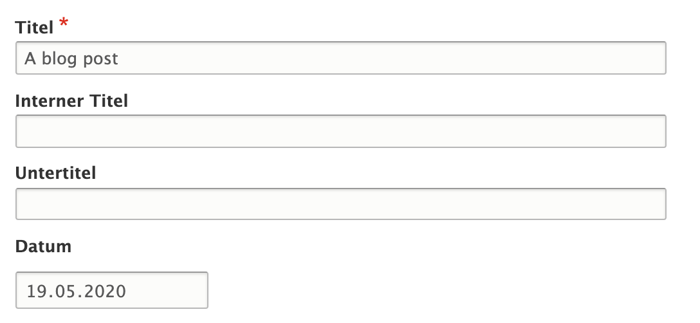
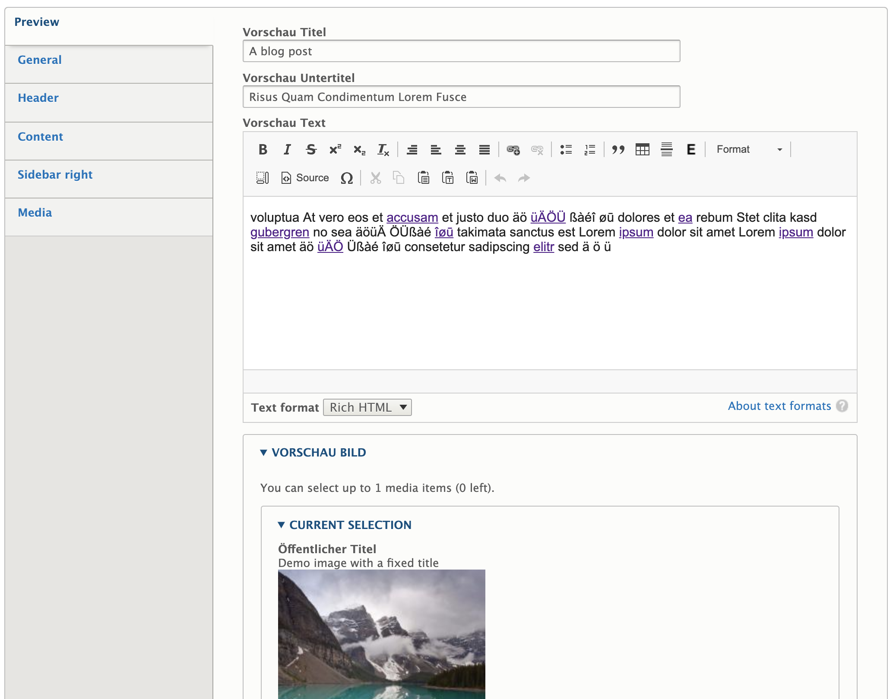
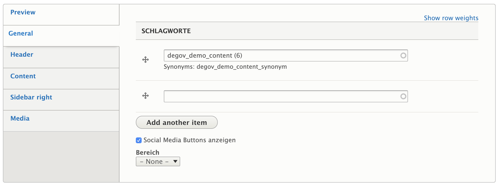
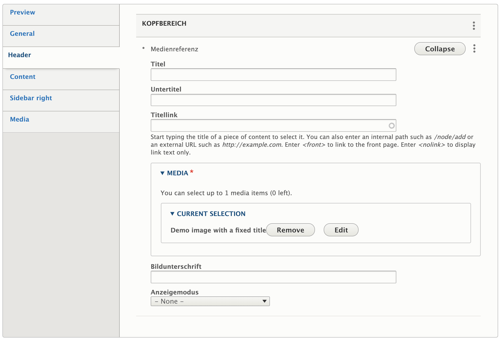
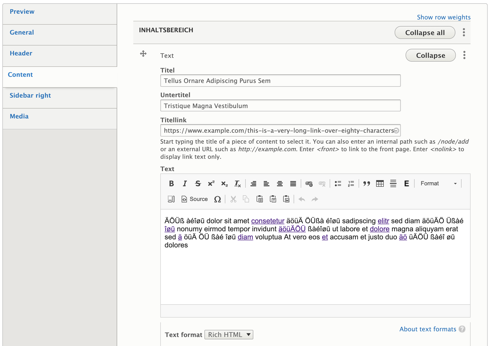
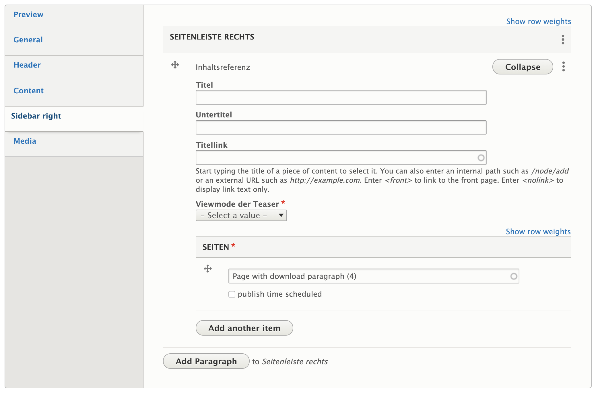
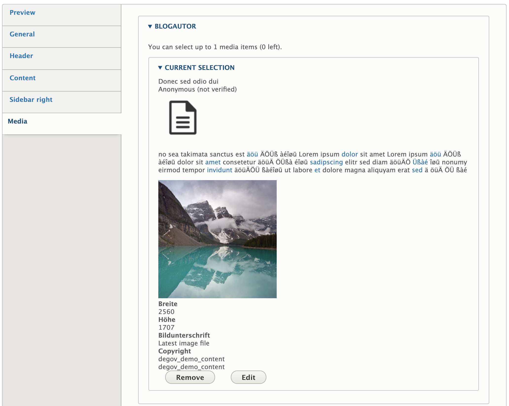

# Blog Post

​If a site features a blog, it will be populated with nodes of this content type.

The *Blog post* content type is segmented into the following tabs:

* Preview
* General
* Header
* Content
* Sidebar right
* Media

Naturally, a *Blog post* has a title, as well as a publication date. In addition, we may enter an optional subtitle and an internal title.

The **Preview** tab enables editors to define a teaser title, text, and a preview image to be displayed in teaser views, such as the “Latest blog content” block.

The **General** tab contains fields to enrich *Blog posts* by adding keywords (with optional support for synonyms) or by sorting them into a thematic section.

In addition, editors can decide whether sharing buttons provided by the [Shariff](https://www.drupal.org/project/shariff) module should be displayed in the post.

In the **Header** tab, editors can add one paragraph, which will be displayed at the top of the *Blog post* page.

The **Content** tab contains a paragraphs field, within which we can assemble the main content of the *Blog post* from a variety of paragraphs, such as text content, media references, and many more.

Similarly the **Sidebar right** can be assembled from a list of paragraphs, combined in whatever way necessary.

Finally, in the **Media** tab we can reference a media entity of the *Person* type, to display detailed information about the post’s author.

## Sidebar

In the sidebar of the node creation and edit form editors can find a number of collapsible fieldsets, providing additional functionality:

* Revision information: The last save time of the node, the username of the author, and a field to optionally describe the changes made between the last revision and the current version. Provided by [Drupal Core](https://www.drupal.org/docs/8/administering-a-drupal-8-site/node-revisions).
* Scheduled moderation: Allows scheduled changes to the moderation state of a node (e.g. publish or archive). Provided by the [Scheduled Publish module](https://www.drupal.org/project/scheduled_publish).
* Menu settings: Optionally create a menu link for the node and place it in one of the available menus. Provided by [Drupal Core](https://www.drupal.org/docs/user_guide/en/menu-link-from-content.html).
* Meta tags: Allows the entry of various meta information, from basics like title and description to specifics like settings for Twitter Cards. Provided by the [Metatag module](https://www.drupal.org/project/metatag).
* Permissions by term: If the site uses Permissions by Term to control access to content based on taxonomies, the users and roles granted access to the current node will be listed here. Provided by the [Permissions by Term module](https://www.drupal.org/project/permissions_by_term).
* Simple XML sitemap: If the content type is enabled for inclusion in an XML sitemap, the general settings for the type can be overridden on a per-node basis here. Provided by the [Simple XML sitemap module](https://www.drupal.org/project/simple_sitemap).
* URL alias: Have Drupal automatically generate a URL alias for the node, or enter a custom alias. Provided by [Drupal Core](https://www.drupal.org/docs/user_guide/en/content-create.html).
* Authoring information: Pre-populated fields with info about the node's author and creation time. Provided by [Drupal Core](https://www.drupal.org/docs/user_guide/en/content-create.html).
* Promotion options: Options to mark the node as promoted to the front page or to make it sticky in lists. Provided by [Drupal Core](https://www.drupal.org/docs/user_guide/en/content-create.html).

## Patches welcome!

deGov was originally developed with a focus primarily on the German market. As you can tell from the mixed languages in the screenshots, a lot of our config​ still reflects this older approach.

We are constantly improving upon this situation ourselves, but we are also happy to receive [contributed patches](https://www.drupal.org/project/issues/degov)!